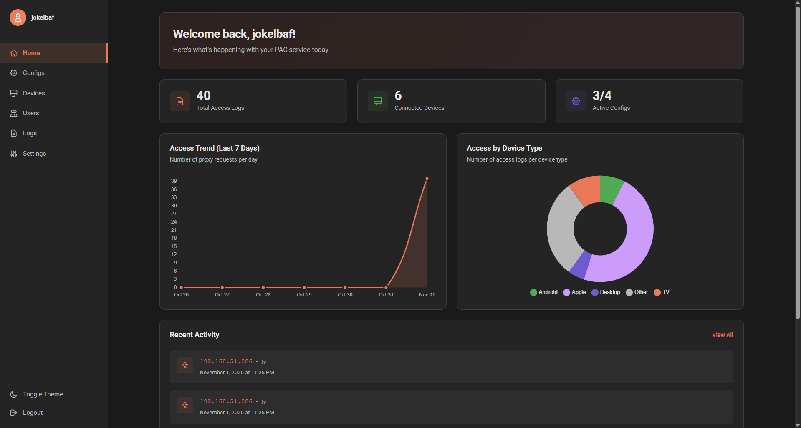

<div align="center" width="100%">
    
</div>

<h1 align="center">Proxyko</h1>

<div align="center">

<a href=""></a>
<a href=""></a>
<a href=""></a>
<a href=""></a>

</div>

<p align="center">
Proxyko is a powerful Proxy Auto-Configuration (PAC) service that allows users to manage per-device proxy settings through a user-friendly web dashboard.
</p>

## Preview


## Features

Proxyko offers a range of features to simplify proxy configuration management:
- **User-friendly Dashboard**: Intuitive web interface for service configuration.
- **Per-Device Proxy Settings**: Assign unique proxy configs to each device using secure tokens.
- **IP-based Access Control**: Restrict device access based on IP addresses for better security.
- **Real-time Monitoring**: Track and analyze the service usage statistics through the dashboard.
- **2FA Support**: Improve account security with two-factor authentication.
- **Built-in Proxy Server**: Optional integrated [proxy server](https://github.com/jokelbaf/proxyko-proxy) with advanced rules configuration.

## Installation

The preferred way to run Proxyko is via Docker Compose. Simply clone the repo, edit [`docker-compose.yml`](docker-compose.yml) to set the required environment variables, and run:
```bash
docker-compose up -d
```

The service is then accessible at `http://localhost:8032` by default.

## Development

Any contributions are welcome! To set up a development environment, follow these steps:

1. Clone the Repository:
   ```bash
   git clone https://github.com/jokelbaf/proxyko.git
   cd proxyko
   ```
2. Create a Virtual Environment:
   ```bash
   uv sync --dev
   ```
3. Configure Environment Variables:
   Create a `.env` file in the root directory and set the necessary environment variables as per the `.env.example` file.
4. Run the Application:
   ```bash
   uv run src/app.py
   ```

To work with proxy-related features, you need to clone and run the [proxy server](https://github.com/jokelbaf/proxyko-proxy) separately.

## Motivation

I love watching anime on Crunchyroll, but some shows have bugged subtitles on mobile devices. I first wrote a simple Proxy server using MITM proxy to automatically fix the subs, but turning it on and off, then configuring proxy settings on my IPhone every time was a pain. I explored different options and found out about PAC files, which allow automatic proxy configuration based on rules. However, managing PAC files manually was cumbersome, so I decided to create Proxyko to streamline the process. I deployed both it and my proxy server on a dedicated server, so now I can toggle the proxy on my phone with just a few taps :)

## License

The project is licensed under the [MIT License](LICENSE.md). Enjoy!
